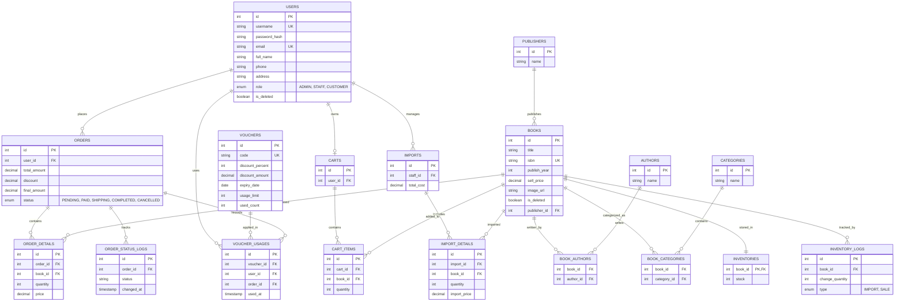

# 📚 Book Store Management System

This is a project for the Java Programming course.

A desktop bookstore management application developed using Java.

The system supports:

* User authentication and role management
* Book management
* Category and author management
* Inventory management
* Order processing
* Shopping cart
* Voucher system
* Import management
* Order status tracking

---

# 📊 Database Schema

---

# 📌 Database Overview

| Module    | Description                                   |
| --------- | --------------------------------------------- |
| Users     | Manage users and roles                        |
| Books     | Manage books, authors, categories, publishers |
| Inventory | Manage stock and inventory logs               |
| Orders    | Handle customer orders                        |
| Imports   | Handle importing books                        |
| Cart      | Shopping cart management                      |
| Voucher   | Discount voucher management                   |

---

# 🔑 Main Relationships

* One publisher can publish many books
* One book can have many authors
* One book can belong to many categories
* One user can create many orders
* One order can contain many order details
* One cart can contain many cart items
* One voucher can be used in many orders

---

## 🛠️ Tech Stack

  
  
  
  
  
  
   
  
  
  
  

---

# ✨ Features

* Authentication & Authorization
* Book CRUD
* Category CRUD
* Author CRUD
* Inventory Management
* Cart Management
* Order Management
* Voucher Management
* Import Management
* Soft Delete Support
